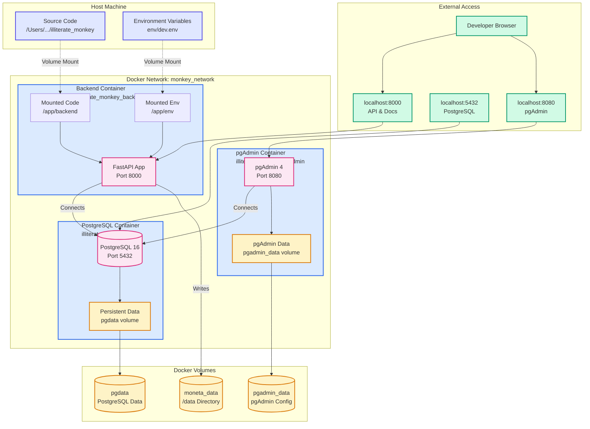

# Docker Development Environment

This document describes the Docker-based development environment architecture for Moneta.

## Overview

The development environment uses Docker Compose to orchestrate multiple services:
- **Backend**: FastAPI application with hot-reload
- **PostgreSQL**: Database server
- **pgAdmin**: Database administration tool

## Architecture Diagram



## Services

### Backend Service

**Container**: `illiterate_monkey_backend`
**Image**: Built from `deploy/docker/Dockerfile`
**Port**: `8000:8000` (host:container)

**Features**:
- Hot-reload enabled for development
- Source code mounted as volume for live changes
- Environment variables loaded from `env/dev.env`
- Persistent data directory mounted at `/data`

**Volume Mounts**:
- `../../backend:/app/backend` - Source code (read/write)
- `../../env:/app/env` - Environment files (read)
- `moneta_data:/data` - Persistent data directory

**Dependencies**:
- Waits for PostgreSQL to be healthy before starting

### PostgreSQL Service

**Container**: `illiterate_monkey_db`
**Image**: `postgres:16-alpine`
**Port**: `5432:5432` (host:container)

**Features**:
- Health check configured (`pg_isready`)
- Persistent data stored in `pgdata` volume
- Environment variables from `env/dev.env`

**Volume Mounts**:
- `pgdata:/var/lib/postgresql/data` - Database files

**Health Check**:
- Command: `pg_isready -U $POSTGRES_USER`
- Interval: 30s
- Timeout: 10s
- Retries: 5

### pgAdmin Service

**Container**: `illiterate_monkey_pgadmin`
**Image**: `dpage/pgadmin4:latest`
**Port**: `8080:80` (host:container)

**Features**:
- Web-based database administration
- Persistent configuration in `pgadmin_data` volume
- Connects to PostgreSQL service

**Volume Mounts**:
- `pgadmin_data:/var/lib/pgadmin` - Configuration and data

**Dependencies**:
- Depends on PostgreSQL service

## Volumes

### Persistent Volumes

1. **pgdata**: PostgreSQL database files
   - Location: Docker managed volume
   - Purpose: Persist database across container restarts

2. **pgadmin_data**: pgAdmin configuration
   - Location: Docker managed volume
   - Purpose: Persist pgAdmin settings and server configurations

3. **moneta_data**: Application data directory
   - Location: Docker managed volume
   - Mounted at: `/data` in backend container
   - Purpose: Persist uploaded files and application data

## Network

**Network Name**: `monkey_network`
**Driver**: `bridge`

All services communicate through this isolated Docker network. Services can reference each other by service name (e.g., `postgres`, `backend`).

## Environment Variables

All services load environment variables from `env/dev.env`:

- Database configuration (`DB_*`, `POSTGRES_*`)
- Application settings (`APP_VERSION`, `ENVIRONMENT`, `DATA_DIR`)
- pgAdmin credentials (`PGADMIN_*`)

## Development Workflow

### Starting the Environment

```bash
cd deploy/compose
docker-compose -f docker-compose-dev.yml up
```

### Accessing Services

- **API**: http://localhost:8000
- **API Docs**: http://localhost:8000/api/docs
- **pgAdmin**: http://localhost:8080
- **PostgreSQL**: localhost:5432

### Hot Reload

The backend service runs with `--reload` flag, automatically restarting when code changes are detected in the mounted `/app/backend/server` directory.

### Stopping the Environment

```bash
docker-compose -f docker-compose-dev.yml down
```

To remove volumes (⚠️ deletes data):
```bash
docker-compose -f docker-compose-dev.yml down -v
```

## File Structure

```
illiterate_monkey/
├── backend/                    # Source code (mounted to container)
├── env/
│   └── dev.env                # Environment variables (mounted to container)
└── deploy/
    ├── docker/
    │   ├── Dockerfile         # Backend container image
    │   └── entrypoint.sh      # Container startup script
    └── compose/
        └── docker-compose-dev.yml  # Service definitions
```

## Data Persistence

- **Database**: Survives container restarts via `pgdata` volume
- **Application Data**: Survives container restarts via `moneta_data` volume
- **Source Code**: Changes on host are immediately reflected in container (volume mount)
- **pgAdmin Config**: Survives container restarts via `pgadmin_data` volume

## Notes

- The backend container uses Python 3.11 with Poetry for dependency management
- Hot-reload is enabled for development convenience
- All services share the same environment file for consistency
- Network isolation ensures services can only communicate through defined interfaces
- Volume mounts allow live code editing without rebuilding containers
