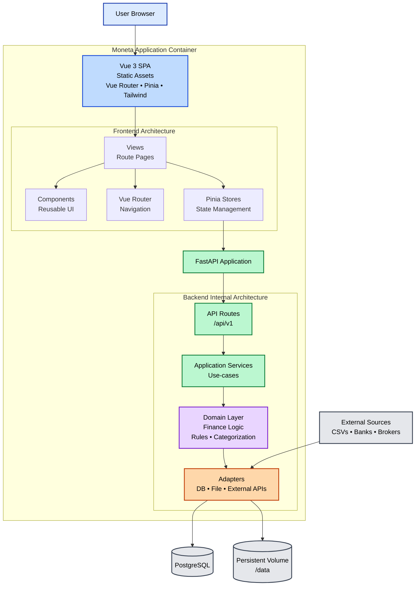

#architecture
___
# 1) High Level System Shape

**Single container** runs:
1. **FastAPI backend** (API, ingestion, rules, reporting endpoints)
2. Frontend (Vue3) served by the backend APIs

# 2) Repository Layout
```
moneta/
	backend/                  # FastAPI poetry module
		server/
	        __init__.py
	        main.py               # FastAPI entrypoint, mounts API + static
	        settings.py           # env + config
	        api/                  # routers
	          v1/
	            routes_*.py
	        domain/               # pure domain logic (no FastAPI imports)
	        services/             # orchestration, use-cases
	        adapters/             # IO boundaries (db, files, external)
	    db/
	        models.py
	        migrations/           # Alembic
	    workers/                  # background jobs (optional v1)
	        observability/        # logging, metrics, tracing stubs
		tests/                    # tests
		pyproject.toml            # requeirements and other pypackage configs
		README.MD                 # empty docs file (requeired)
	env/
		dev.env                   # Development Environment Vars
		dev.template              # Template with needed vars to populate
	frontend/                     # Vue 3 app
      src/
        main.ts              # Application entry point
        App.vue              # Root component
        components/          # Reusable components
        views/               # Route-level pages
        router/              # Vue Router configuration
        stores/              # Pinia state management
        style.css            # Global styles
      public/                # Static assets
      index.html             # HTML entry point
      vite.config.ts         # Vite build configuration
      package.json           # npm dependencies
      tsconfig.json          # TypeScript configuration
      tsconfig.app.json      # TypeScript app config
      tsconfig.node.json     # TypeScript node config
  deploy/
    docker/
      Dockerfile
      entrypoint.sh
    compose/
      docker-compose.dev.yml
      docker-compose.prod.yml
```

# 3) **Container strategy**

## 3.1) Development Container (single container, dual services)

The development environment uses a single container that runs both backend and frontend:

- **Container**: `illiterate_monkey_app`
- **Base Image**: `python:3.11-slim` with Node.js 20.x installed
- **Services Running**:
  1. FastAPI backend (Uvicorn with `--reload`) on port 8000
  2. Vite dev server (frontend) on port 5173
- **Hot Reload**: Both services support hot-reload via volume mounts
- **Volume Mounts**:
  - Backend code: `../../backend:/app/backend`
  - Frontend code: `../../frontend:/app/frontend`
  - Frontend node_modules: Preserved in named volume

## 3.2) Production Build Steps (multi-staged Dockerfile - future)

For production, the build will use a multi-stage approach:

- Stage A: Build Vue frontend
  - Install npm dependencies
  - Run `npm run build` (type check + Vite build)
  - Output: `frontend/dist/` directory with static assets
- Stage B: Install Python dependencies + mount backend folder
  - Install Poetry dependencies
  - Copy backend code
  - Copy `frontend/dist/` into backend package (or `/static` folder)
- Stage C: Run FastAPI with Gunicorn+Uvicorn workers
  - FastAPI serves static files from `dist/`
  - SPA fallback: unknown routes return `index.html`

## 3.3) Serving frontend

**Development**: Frontend is served by Vite dev server on port 5173 with HMR

**Production** (future): FastAPI will mount:
- StaticFiles(directory=".../dist")
- SPA fallback: unknown routes return index.html

Example routing convention:

- /api/v1/... for API
- /assets/... for built assets
- /* for SPA

# 4) Runtime process model

- **Gunicorn** (master) + **UvicornWorker** (workers)
- No separate node server


# 5) CI/CD baseline (infra-first)
- PreCommit
- Linters:
    - Python: ruff + mypy (optional)
    - Vue/TypeScript: eslint + vue-tsc typecheck
- Test:
	- Backend: Pytest
	- Frontend: Vitest + Vue Test Utils (configured and working)
- Build docker image
  - Build frontend (npm run build)
  - Build backend container
- Run smoke test

# 6) Frontend Architecture

## 6.1) Technology Stack
- **Framework**: Vue 3 (Composition API)
- **Language**: TypeScript
- **Build Tool**: Vite
- **Routing**: Vue Router 4
- **State Management**: Pinia
- **Styling**: Tailwind CSS 4

## 6.2) Frontend Structure
- **Views** (`src/views/`): Route-level page components
- **Components** (`src/components/`): Reusable UI components
- **Stores** (`src/stores/`): Pinia state management (Composition API style)
- **Router** (`src/router/`): Vue Router configuration and routes

## 6.3) Development Workflow
- **Dev Server**: `npm run dev` (Vite with HMR)
- **Build**: `npm run build` (TypeScript check + Vite build)
- **Preview**: `npm run preview` (Test production build)

## 6.4) Frontend-Backend Communication
- REST API calls to `/api/v1/*` endpoints
- (Future) API service layer for centralized communication
- (Future) Error handling and loading states

For detailed frontend documentation, see:
- [Frontend Package Structure](./frontend/Frontend%20Package%20Structure.md)
- [Frontend Architecture](./frontend/Frontend%20Architecture.md)


