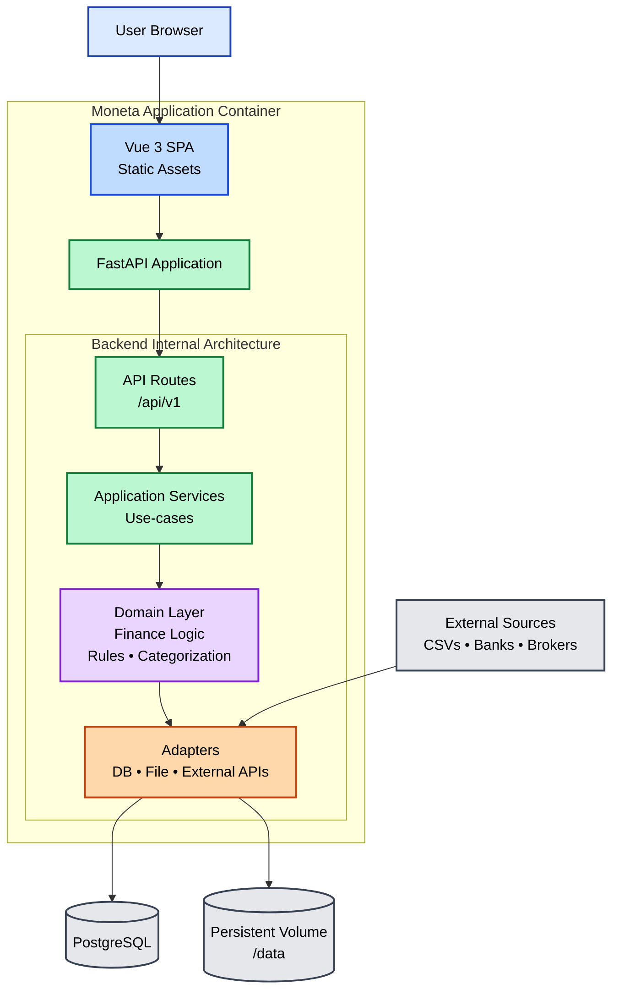

#architecture
___
# 1) High Level System Shape

**Single container** runs:
1. **FastAPI backend** (API, ingestion, rules, reporting endpoints)
2. Frontend (Vue3) served by the backend APIs

# 2) Repository Layout
```
moneta/
	backend/                  # FastAPI poetry module
		server/
	        __init__.py
	        main.py               # FastAPI entrypoint, mounts API + static
	        settings.py           # env + config
	        api/                  # routers
	          v1/
	            routes_*.py
	        domain/               # pure domain logic (no FastAPI imports)
	        services/             # orchestration, use-cases
	        adapters/             # IO boundaries (db, files, external)
	    db/
	        models.py
	        migrations/           # Alembic    
	    workers/                  # background jobs (optional v1)
	        observability/        # logging, metrics, tracing stubs
		tests/                    # tests
		pyproject.toml            # requeirements and other pypackage configs
		README.MD                 # empty docs file (requeired)
	env/
		dev.env                   # Development Environment Vars
		dev.template              # Template with needed vars to populate
	frontend/                     # Vue 3 app
      src/
      public/
      index.html
      vite.config.ts
      package.json
      tests/
  deploy/
    docker/
      Dockerfile
      entrypoint.sh
    compose/
      docker-compose.dev.yml
      docker-compose.prod.yml
```

# 3) **Container strategy (single image)**

## 3.1) Build  Steps (multi-staged Dockerfile)

- Stage A: build Vue -> frontend/src/dist
- Stage B: Install Python depth + mount backend folder
- Copy dist/ into backend package (or /static folder)
-  Run FastAPI with Gunicorn+Uvicorn workers

## 3.2) Serving frontend

FastAPI mounts:
- StaticFiles(directory=".../dist")
- SPA fallback: unknown routes return index.html

Example routing convention:

- /api/v1/... for API
- /assets/... for built assets
- /* for SPA

# 4) Runtime process model

- **Gunicorn** (master) + **UvicornWorker** (workers)
- No separate node server


# 5) CI/CD baseline (infra-first)
- PreCommit
- Linters:
    - Python: ruff + mypy (optional)
    - Vue: eslint + typecheck
- Test:
	- Pytest
- Build docker image
- Run smoke test


