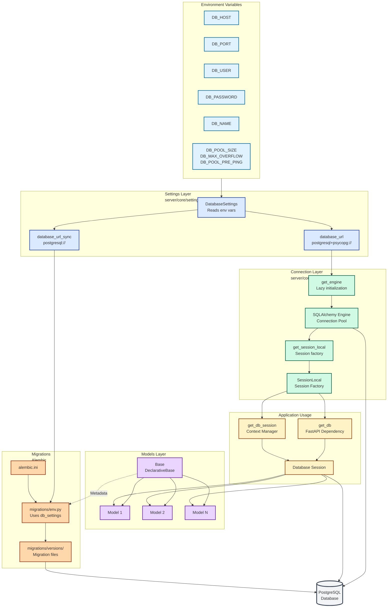
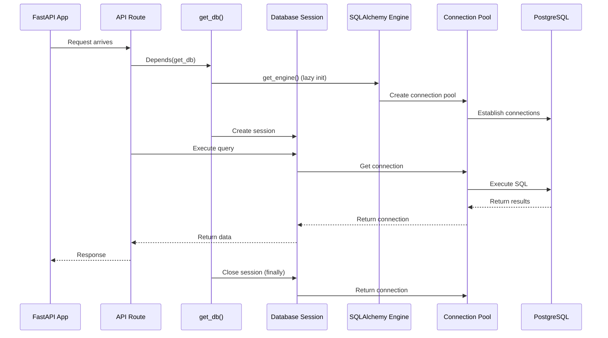

# Database Architecture

This document describes how database connections, models, and migrations work in the Moneta backend.

## Overview

The backend uses:
- **PostgreSQL** as the database
- **SQLAlchemy 2.0+** as the ORM
- **Alembic** for database migrations
- **psycopg** (v3) as the PostgreSQL driver

## Architecture Diagram



## Connection Flow



## Database Connection

### Connection Settings

Database configuration is managed through `server/core/settings/database.py` using the `DatabaseSettings` class. All settings are read from environment variables with sensible defaults.

### Connection Architecture

The database connection uses **lazy initialization**:

1. **Engine Creation**: The SQLAlchemy engine is created only when first needed (not at import time)
2. **Session Factory**: Session factory is created lazily, bound to the engine
3. **Connection Pooling**: Configured with pool size, max overflow, and connection health checks

### Key Components

#### `server/core/settings/database.py`
- `DatabaseSettings` class: Reads environment variables and generates database URLs
- Properties:
  - `database_url`: Async PostgreSQL URL (`postgresql+psycopg://...`)
  - `database_url_sync`: Sync PostgreSQL URL (`postgresql://...`) for Alembic

#### `server/core/database.py`
- `get_engine()`: Returns the database engine (lazy initialization)
- `get_session_local()`: Returns the session factory (lazy initialization)
- `get_db()`: FastAPI dependency for database sessions (auto-closes)
- `get_db_session()`: Context manager for manual session handling
- `init_db()`: Creates tables from models (not recommended, use Alembic instead)

## Models

### Base Class

All models inherit from `Base` defined in `server/models/__init__.py`:

```python
from server.models import Base

class MyModel(Base):
    __tablename__ = "my_table"
    # ... columns
```

### Model Structure

Models are stored in `server/models/` directory:
- Each model should be in its own file or logically grouped
- Models must be imported in `migrations/env.py` for Alembic autogenerate to work

### Example Model

```python
from sqlalchemy import Column, Integer, String, DateTime
from sqlalchemy.sql import func
from server.models import Base

class Example(Base):
    __tablename__ = "examples"

    id = Column(Integer, primary_key=True, index=True)
    name = Column(String(255), nullable=False)
    created_at = Column(DateTime(timezone=True), server_default=func.now())
    updated_at = Column(DateTime(timezone=True), onupdate=func.now())
```

### Account Model

The `Account` model represents financial accounts in the system.

**Table:** `accounts`

**Fields:**
- `id` (Integer, Primary Key): Unique identifier
- `name` (String(255), Required): Account name
- `institution` (String(255), Required): Financial institution name
- `currency` (Enum, Required): ISO 4217 currency code (using `iso4217` library)
- `type` (Enum, Required): Account type (checking, savings, credit_card, cash, investment, loan)
- `economic_area` (Enum, Optional): Economic region classification (eu, us, uk, cis, mena, apac, china, other)
- `datelock_from` (Date, Optional): Date lock for ingestion control
- `created_at` (DateTime, Auto): Record creation timestamp
- `updated_at` (DateTime, Auto): Record last update timestamp

**Enums:**
- `AccountType`: checking, savings, credit_card, cash, investment, loan
- `Currency`: All ISO 4217 currency codes (dynamically generated from `iso4217` library)
- `EconomicArea`: eu, us, uk, cis, mena, apac, china, other

**Date Lock (`datelock_from`):**
- Per-account ingestion guardrail
- Transactions before this date cannot be ingested or reprocessed
- `null` means no lock (full historical ingestion allowed)
- Affects future ingestion only (does not delete existing data)

**Model File:** `server/models/account.py`

**Migration:** `60f2323257db_add_accounts_table.py`

## Migrations (Alembic)

### Migration Structure

```
backend/
├── alembic.ini              # Alembic configuration
└── migrations/
    ├── env.py              # Migration environment (connects to DB settings)
    ├── script.py.mako      # Migration template
    └── versions/           # Migration files
        └── 0001_baseline.py
```

### How Migrations Work

1. **Configuration**: `alembic.ini` points to `migrations/` folder
2. **Environment**: `migrations/env.py` imports database settings and models
3. **Database URL**: Set dynamically from `db_settings.database_url_sync`
4. **Model Detection**: Uses `Base.metadata` to detect model changes

### Creating Migrations

1. **Create/Modify Models**: Add or update models in `server/models/`
2. **Import Models**: Add model imports to `migrations/env.py` (commented section)
3. **Generate Migration**:
   ```bash
   poetry run alembic revision --autogenerate -m "description"
   ```
4. **Review Migration**: Check the generated file in `migrations/versions/`
5. **Apply Migration**:
   ```bash
   poetry run alembic upgrade head
   ```

### Migration Commands

- **Create empty migration**: `poetry run alembic revision -m "message"`
- **Auto-generate migration**: `poetry run alembic revision --autogenerate -m "message"`
- **Apply migrations**: `poetry run alembic upgrade head`
- **Rollback one migration**: `poetry run alembic downgrade -1`
- **Show current revision**: `poetry run alembic current`
- **Show history**: `poetry run alembic history`

## Using Database in FastAPI

### Dependency Injection (Recommended)

```python
from fastapi import Depends
from sqlalchemy.orm import Session
from server.core.database import get_db

@router.get("/items")
def get_items(db: Session = Depends(get_db)):
    items = db.query(Item).all()
    return items
```

The `get_db()` dependency:
- Creates a session
- Yields it to the route handler
- Automatically closes the session when done
- Handles rollback on exceptions

### Context Manager (Manual Control)

```python
from server.core.database import get_db_session

with get_db_session() as db:
    item = Item(name="test")
    db.add(item)
    # Automatically commits on success, rolls back on error
```

## Connection Pooling

The database uses connection pooling with the following settings:

- **Pool Size**: Number of connections to maintain (default: 5)
- **Max Overflow**: Additional connections allowed beyond pool size (default: 10)
- **Pool Pre-ping**: Checks connection health before use (default: true)
- **Echo**: Logs SQL queries (default: false, enable for debugging)

## Best Practices

1. **Always use migrations** - Never use `init_db()` in production
2. **Import models in env.py** - Required for autogenerate to work
3. **Review generated migrations** - Always check autogenerated migrations before applying
4. **Use dependency injection** - Prefer `get_db()` over manual session management
5. **Handle transactions** - Use context managers or ensure proper commit/rollback
6. **Don't run migrations in entrypoint** - Run migrations separately, not on every container start

## Testing

Tests use an in-memory SQLite database to avoid requiring PostgreSQL. See [Testing.md](./Testing.md) for details.

## Troubleshooting

### Connection Issues
- Verify environment variables are set correctly
- Check PostgreSQL is running and accessible
- Verify network connectivity (in containers, use service names)

### Migration Issues
- Ensure models are imported in `migrations/env.py`
- Check database URL is correct in settings
- Verify database user has CREATE/ALTER permissions

### Session Issues
- Always use `get_db()` or `get_db_session()` - don't create sessions manually
- Ensure sessions are properly closed (automatic with dependencies)
- Check for uncommitted transactions
