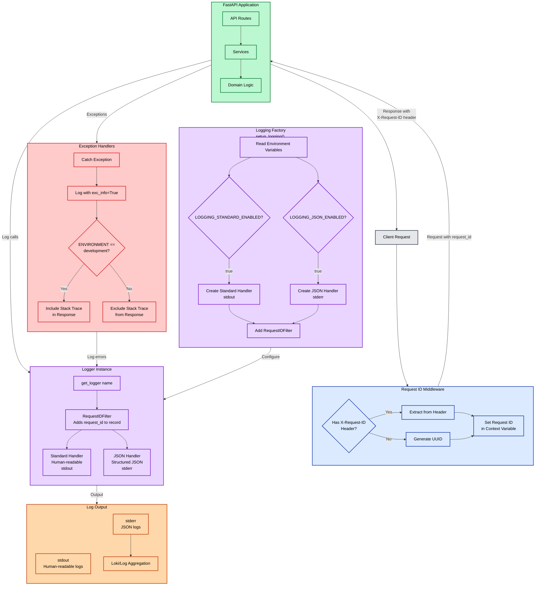
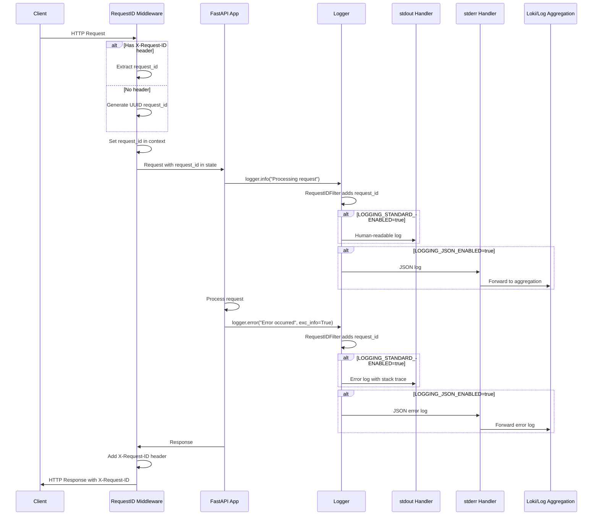

# Logging Architecture

This document describes the logging architecture and configuration for the Moneta backend.

## Overview

The Moneta backend uses a dual-logging architecture that supports both human-readable logs for development and structured JSON logs for production monitoring and integration with log aggregation systems like Loki.

## Architecture Diagram



## Request Flow with Logging



## Architecture

### Dual Logger System

The logging system supports two independent loggers that can be enabled/disabled via environment variables:

1. **Standard Logger** (stdout)
   - Human-readable format
   - Includes timestamps, log levels, logger names, messages, and request IDs
   - Ideal for local development and debugging

2. **JSON Logger** (stderr)
   - Structured JSON format
   - Includes all standard fields plus request IDs
   - Designed for log aggregation systems (Loki, ELK, etc.)
   - Ideal for production monitoring

### Request ID Correlation

Every request is assigned a unique `request_id` that:
- Is generated automatically (UUID) or extracted from `X-Request-ID` header
- Is added to all log entries for that request
- Is included in HTTP response headers
- Enables correlation of logs across services and requests

## Configuration

### Environment Variables

Logging behavior is controlled via environment variables:

| Variable | Purpose | Default | Values |
|----------|---------|---------|--------|
| `LOGGING_STANDARD_ENABLED` | Enable standard logging | `true` | `true`, `false`, `1`, `0`, `yes`, `no` |
| `LOGGING_JSON_ENABLED` | Enable JSON logging | `true` | `true`, `false`, `1`, `0`, `yes`, `no` |
| `LOGGING_LEVEL` | Log level | `INFO` | `DEBUG`, `INFO`, `WARNING`, `ERROR`, `CRITICAL` |

### Configuration Examples

**Development (both enabled):**
```bash
LOGGING_STANDARD_ENABLED=true
LOGGING_JSON_ENABLED=true
LOGGING_LEVEL=DEBUG
```

**Production with Loki (JSON only):**
```bash
LOGGING_STANDARD_ENABLED=false
LOGGING_JSON_ENABLED=true
LOGGING_LEVEL=INFO
```

**Local development (standard only):**
```bash
LOGGING_STANDARD_ENABLED=true
LOGGING_JSON_ENABLED=false
LOGGING_LEVEL=DEBUG
```

## Implementation

### Core Components

#### `server/core/logging.py`

The logging factory module that configures loggers based on environment variables.

**Key Functions:**
- `setup_logging()` - Configures logging system at application startup
- `get_logger(name)` - Returns a logger instance for use in code

**Key Classes:**
- `RequestIDFilter` - Logging filter that adds request_id to all log records

**Handler Factories:**
- `_create_standard_handler()` - Creates stdout handler with human-readable format
- `_create_json_handler()` - Creates stderr handler with JSON format

#### `server/core/middleware.py`

Request ID middleware that:
- Generates or extracts request ID from headers
- Sets request ID in logging context
- Adds request ID to response headers

**Class:** `RequestIDMiddleware`

### Log Format

#### Standard Format (stdout)

```
2025-12-25 10:30:45 [INFO] server.api.routers.uploads: File uploaded successfully [request_id=550e8400-e29b-41d4-a716-446655440000]
```

#### JSON Format (stderr)

```json
{
  "timestamp": "2025-12-25T10:30:45.123Z",
  "level": "INFO",
  "name": "server.api.routers.uploads",
  "message": "File uploaded successfully",
  "request_id": "550e8400-e29b-41d4-a716-446655440000",
  "file_id": "550e8400-e29b-41d4-a716-446655440000",
  "uploaded_filename": "data.csv",
  "size": 1024,
  "path": "/data/uploads/550e8400-e29b-41d4-a716-446655440000.csv"
}
```

## Usage

### Getting a Logger

```python
from server.core.logging import get_logger

logger = get_logger(__name__)

logger.info("Application started")
logger.error("An error occurred", exc_info=True)
```

### Logging with Extra Context

```python
logger.info(
    "File uploaded successfully",
    extra={
        "file_id": file_id,
        "uploaded_filename": filename,
        "size": file_size,
    }
)
```

**Note:** Avoid using reserved LogRecord attributes in `extra`:
- `name`, `msg`, `args`, `created`, `filename`, `funcName`, `levelname`, `levelno`, `lineno`, `module`, `msecs`, `message`, `pathname`, `process`, `processName`, `relativeCreated`, `thread`, `threadName`, `exc_info`, `exc_text`, `stack_info`

Use descriptive names like `uploaded_filename` instead of `filename`.

## Error Handling

### Exception Logging

Exceptions are automatically logged with stack traces:

```python
try:
    # Some operation
except Exception as e:
    logger.error("Operation failed", exc_info=True)
    raise
```

### Error Response Format

In development mode, error responses include stack traces:

```json
{
  "error": "Internal server error",
  "message": "Detailed error message",
  "request_id": "550e8400-e29b-41d4-a716-446655440000",
  "traceback": "Traceback (most recent call last):\n  ..."
}
```

In production mode, stack traces are omitted for security.

## Integration with Loki

### Configuration

When using Loki for log aggregation:

1. Configure JSON logging only:
   ```bash
   LOGGING_STANDARD_ENABLED=false
   LOGGING_JSON_ENABLED=true
   ```

2. Configure Docker to capture stderr:
   ```yaml
   logging:
     driver: "json-file"
     options:
       labels: "app=moneta"
   ```

3. Use Promtail or similar to forward logs to Loki

### Log Labels

The JSON logs include:
- `request_id` - For request correlation
- `level` - Log level
- `name` - Logger name (module path)
- `timestamp` - ISO 8601 timestamp
- Custom fields from `extra` parameter

These can be used as labels in Loki for efficient querying.

## Best Practices

1. **Use appropriate log levels:**
   - `DEBUG`: Detailed information for debugging
   - `INFO`: General informational messages
   - `WARNING`: Warning messages (non-critical issues)
   - `ERROR`: Error messages (operations failed)
   - `CRITICAL`: Critical errors (application may stop)

2. **Include context in logs:**
   - Use `extra` parameter to add relevant context
   - Include request IDs for correlation
   - Add relevant identifiers (user_id, file_id, etc.)

3. **Avoid sensitive information:**
   - Never log passwords, tokens, or sensitive user data
   - Be careful with PII (personally identifiable information)

4. **Use structured logging:**
   - Prefer `extra` parameter over string formatting for structured data
   - This enables better querying in log aggregation systems

5. **Request ID propagation:**
   - Always include request_id in log entries
   - Use request_id for correlating logs across services

## Troubleshooting

### Logs not appearing

1. Check environment variables are set correctly
2. Verify at least one logger is enabled
3. Check log level is appropriate (DEBUG shows more than INFO)

### Request ID missing

- Ensure `RequestIDMiddleware` is added to the FastAPI app
- Check that `setup_logging()` is called during application startup

### JSON logs not parsing correctly

- Verify `python-json-logger` is installed
- Check that JSON logger is enabled via `LOGGING_JSON_ENABLED`

## Future Enhancements

Potential future improvements:
- Log rotation configuration
- Custom log formatters
- Integration with distributed tracing (OpenTelemetry)
- Log sampling for high-volume scenarios
- Contextual logging (user context, request context)
