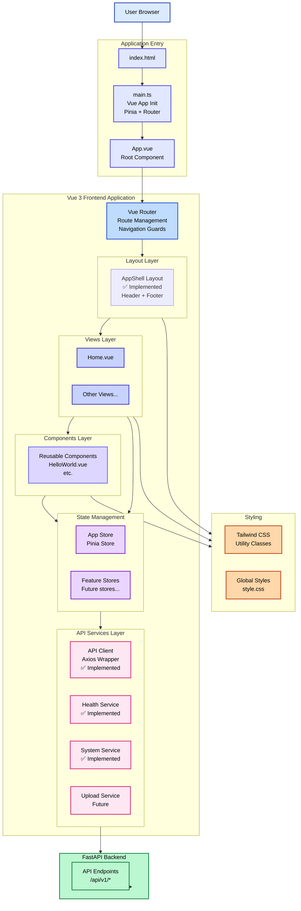
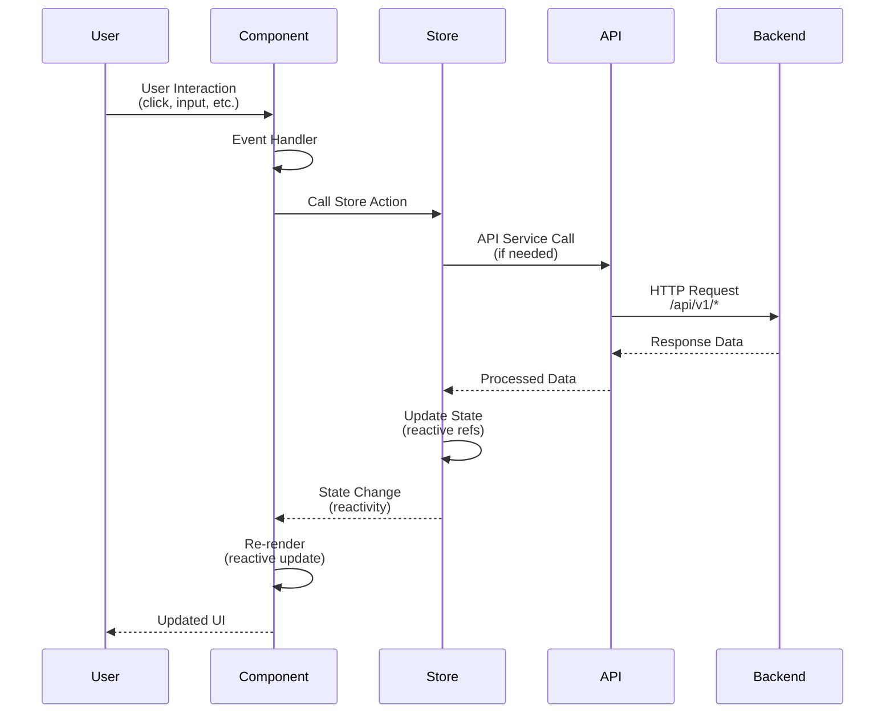
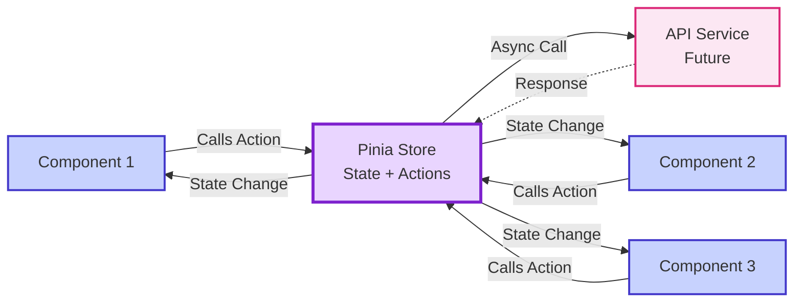

# Frontend Architecture

## Overview

The Moneta frontend is a Vue 3 Single Page Application (SPA) that communicates with the FastAPI backend through REST API endpoints. The application uses modern Vue 3 patterns with the Composition API, TypeScript for type safety, and follows a component-based architecture.

## Architecture Diagram



## Architecture Principles

### 1. Component-Based Architecture
- **Layouts**: Layout wrapper components (`src/layouts/`)
- **Views**: Route-level page components (`src/views/`)
- **Components**: Reusable UI components (`src/components/`)
- **Stores**: State management modules (`src/stores/`)
- **Services**: API service layer (`src/services/`)

### 2. Separation of Concerns
- **Presentation**: Vue components handle UI rendering
- **State Management**: Pinia stores manage application state
- **Routing**: Vue Router handles navigation and route management
- **API Communication**: Service layer for backend communication (axios-based)

### 3. Type Safety
- TypeScript throughout the application
- Strict mode enabled
- Type checking during build

## Application Flow

### Initialization

1. **Entry Point** (`src/main.ts`):
   - Imports global styles
   - Creates Vue application instance
   - Initializes Pinia store
   - Initializes Vue Router
   - Mounts app to `#app` DOM element

2. **Root Component** (`src/App.vue`):
   - Renders `<router-view />` for route-based rendering
   - Provides base app container

3. **Router** (`src/router/index.ts`):
   - Matches current URL to route definition
   - Uses AppShell layout for nested routes
   - Loads corresponding view component
   - Renders view in AppShell's `<router-view />`

4. **Layout** (`src/layouts/AppShell.vue`):
   - Provides consistent page structure (header, main, footer)
   - Renders nested route views in main content area
   - Handles navigation and branding

### Component Lifecycle



**Text Flow:**
```
User Interaction
    ↓
Component Event Handler
    ↓
Store Action (if needed)
    ↓
API Call (if needed) → Backend
    ↓
State Update (Pinia store)
    ↓
Reactive UI Update
```

## State Management (Pinia)

### Store Structure

Stores use the Composition API style with `defineStore`:

```typescript
export const useAppStore = defineStore("app", () => {
  // State (reactive refs)
  const count = ref(0);

  // Getters (computed)
  const doubleCount = computed(() => count.value * 2);

  // Actions (functions)
  function increment() {
    count.value++;
  }

  return { count, doubleCount, increment };
});
```

### Store Organization

- **Domain-based stores**: One store per domain/feature
- **Shared stores**: Common application state (e.g., `app.ts`)
- **Barrel exports**: `src/stores/index.ts` for easier imports

### State Flow



**Steps:**
1. **Component** calls store action
2. **Action** modifies state (or calls API)
3. **State change** triggers reactivity
4. **Components** using the state automatically update

## Routing (Vue Router)

### Route Configuration

Routes are defined in `src/router/index.ts`:
- **History mode**: `createWebHistory` for clean URLs
- **Route definitions**: Array of route objects
- **Lazy loading**: (Future) Can load components dynamically

### Navigation

- **Declarative**: `<router-link to="/path">` component
- **Programmatic**: `router.push("/path")` or `router.replace("/path")`

### Route Guards

(Future) Can add navigation guards for:
- Authentication checks
- Permission validation
- Data prefetching

## Component Patterns

### Composition API

All components use `<script setup>` with Composition API:

```vue
<script setup lang="ts">
import { ref, computed } from "vue";
import { useAppStore } from "@/stores";

const store = useAppStore();
const localState = ref("");

const computedValue = computed(() => {
  return store.count * 2;
});
</script>
```

### Component Communication

1. **Props Down**: Parent → Child via props
2. **Events Up**: Child → Parent via `emit()`
3. **Stores**: Shared state via Pinia stores
4. **Provide/Inject**: (Future) Deep component tree communication

## Styling Architecture

### Tailwind CSS

- **Utility-first**: Classes applied directly in templates
- **Responsive**: Built-in responsive breakpoints
- **Customization**: (Future) Can extend theme in config

### Style Organization

- **Global styles**: `src/style.css` (Tailwind directives)
- **Component styles**: Scoped `<style scoped>` blocks
- **Utility classes**: Used directly in templates

## API Communication

### Current State

API communication layer is implemented using axios. Current structure:

```
src/
  services/
    api.ts            # Axios client wrapper with interceptors
    health.ts         # Health API service ✅
    system.ts         # System API service ✅
    index.ts          # Service barrel export
    uploads.ts        # Uploads API service (future)
```

### API Client Pattern

```typescript
// services/api.ts
import axios, { type AxiosInstance } from "axios";

export const apiClient: AxiosInstance = axios.create({
  baseURL: import.meta.env.VITE_API_BASE_URL || "http://localhost:8000/api/v1",
  timeout: 10000,
});

// Request/response interceptors for error handling
apiClient.interceptors.response.use(
  (response) => response,
  (error) => {
    // Handle errors
    return Promise.reject(error);
  }
);

// services/health.ts
import { apiClient } from "./api";

export const healthService = {
  async getHealth(): Promise<HealthInfo> {
    const response = await apiClient.get<HealthInfo>("/health");
    return response.data;
  },
};
```

## Build and Deployment

### Development

- **Dev Server**: Vite dev server with HMR running in Docker container
- **Container Setup**: Frontend runs alongside backend in `illiterate_monkey_app` container
- **Port**: 5173 (exposed from container)
- **Hot Module Replacement**: Instant updates without page reload
- **Source Maps**: Full source maps for debugging
- **Volume Mounts**: Frontend code mounted for live editing
- **Access**: http://localhost:5173

### Production Build

1. **Type Check**: `vue-tsc -b` validates TypeScript
2. **Build**: Vite bundles and optimizes assets
3. **Output**: `dist/` directory with static files
4. **Serving**: Backend serves static files from `dist/` (future implementation)

### Build Process

```
TypeScript Source Files
    ↓
Vue SFC Compilation
    ↓
TypeScript Compilation
    ↓
Asset Processing (CSS, images, etc.)
    ↓
Code Splitting & Bundling
    ↓
Optimization (minification, tree-shaking)
    ↓
dist/ (Production Bundle)
```

## Environment Configuration

### Environment Variables

(Future) Can use Vite environment variables:
- `.env` - Default
- `.env.local` - Local overrides
- `.env.production` - Production overrides

Access via `import.meta.env.VITE_*`

### Configuration Pattern

```typescript
// config.ts
export const config = {
  apiBaseUrl: import.meta.env.VITE_API_BASE_URL || "/api/v1",
  appName: import.meta.env.VITE_APP_NAME || "Moneta",
};
```

## Error Handling

### Current State

Error handling is partially implemented:

1. **API Error Handling**: ✅ Centralized error interceptor in `api.ts`
2. **Component Error Boundaries**: (Future) Vue 3 error handling
3. **User Feedback**: ✅ Error messages displayed in components (e.g., Home view)
4. **Loading States**: ✅ Loading indicators in components (e.g., Home view)

### Error Handling Pattern

```typescript
// services/api.ts
apiClient.interceptors.response.use(
  (response) => response,
  (error) => {
    // Handle error
    // Show user notification
    // Log error
    return Promise.reject(error);
  }
);
```

## Testing Strategy

### Future Testing Setup

- **Unit Tests**: Vitest for component and store testing
- **Component Tests**: Vue Test Utils for component testing
- **E2E Tests**: (Future) Playwright or Cypress

### Test Structure

```
src/
  components/
    HelloWorld.vue
    __tests__/
      HelloWorld.spec.ts
  stores/
    app.ts
    __tests__/
      app.spec.ts
```

## Performance Considerations

### Code Splitting

- **Route-based**: Each route can be lazy-loaded
- **Component-based**: Large components can be async

### Optimization

- **Tree Shaking**: Unused code removed automatically
- **Asset Optimization**: Images, fonts optimized during build
- **Bundle Analysis**: (Future) Can analyze bundle size

## Security Considerations

### XSS Prevention

- Vue automatically escapes template content
- Use `v-html` only with trusted content

### API Security

- (Future) CSRF token handling
- (Future) Authentication token management
- (Future) Secure storage of sensitive data

## Future Enhancements

### Planned Features

1. **API Service Layer**: Centralized API communication
2. **Form Validation**: Form handling and validation
3. **Authentication**: Login, logout, token management
4. **Error Handling**: Comprehensive error handling
5. **Loading States**: Loading indicators and skeletons
6. **Testing**: Unit and integration tests
7. **Internationalization**: (Future) i18n support
8. **Accessibility**: ARIA labels and keyboard navigation

### Architecture Evolution

As the application grows:
- **Feature modules**: Organize by feature (accounts, statements, etc.)
- **Shared utilities**: Common helper functions
- **Type definitions**: Shared TypeScript types
- **Constants**: Application constants and configuration
