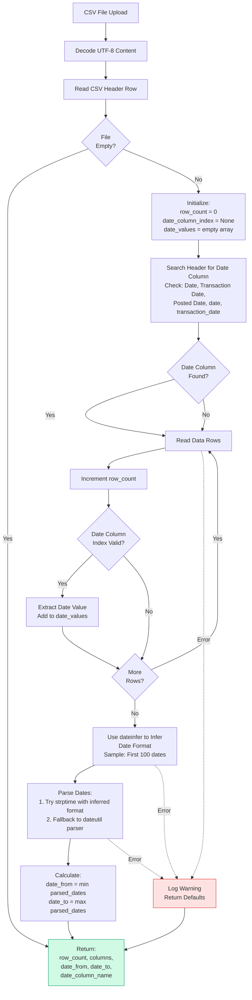
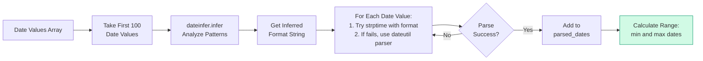

# CSV Metadata Extraction

## Overview

When a CSV statement file is uploaded, the system automatically extracts metadata including row count, column names, date range, and detects the date column. This metadata is used for display, validation, and later ingestion.

## Extraction Flow



## Date Column Detection

The system searches for date columns using a predefined list of common names:

```python
date_column_names = [
    "Date",
    "Transaction Date",
    "Posted Date",
    "date",
    "transaction_date",
]
```

**Detection Logic:**
1. Iterate through header columns
2. Check if column name matches any in the list (case-sensitive)
3. Store the first match as `date_column_name`
4. Use its index to extract date values from data rows

**Why Persist `date_column`?**
- Ensures consistent date column usage between upload and ingestion
- Avoids mismatches if CSV has multiple date-like columns
- Makes ingestion deterministic

## Date Format Inference



**Inference Strategy:**
1. Use `dateinfer` library to analyze date patterns
2. Sample first 100 date values for performance
3. Get inferred format string (e.g., `"%Y-%m-%d"`)
4. Parse dates using inferred format
5. Fallback to `dateutil.parser` if format parsing fails
6. Calculate min/max for date range

## Error Handling

The extraction process is **non-fatal** - failures don't prevent file upload:

- **Empty file:** Returns `(0, None, None, None, None)`
- **No date column:** Returns `(row_count, columns, None, None, None)`
- **Date parsing failures:** Logs warning, continues with other metadata
- **Format inference failures:** Falls back to dateutil parser

All errors are logged but don't block the upload process.

## Return Values

The `_extract_csv_metadata` method returns:

```python
Tuple[int, Optional[List[str]], Optional[date], Optional[date], Optional[str]]
```

1. **row_count** (int): Number of data rows (excluding header)
2. **columns** (List[str] | None): Array of column names from header
3. **date_from** (date | None): Earliest date found in date column
4. **date_to** (date | None): Latest date found in date column
5. **date_column** (str | None): Name of detected date column

## Example

**Input CSV:**
```csv
Date,Description,Amount
2024-01-01,Coffee,-4.50
2024-01-15,Salary,5000.00
2024-02-01,Rent,-1200.00
```

**Extracted Metadata:**
- `row_count = 3`
- `columns = ["Date", "Description", "Amount"]`
- `date_from = 2024-01-01`
- `date_to = 2024-02-01`
- `date_column = "Date"`

## Related Components

- **Service:** `backend/server/services/statement_file.py` - `_extract_csv_metadata` method
- **Model:** `backend/server/models/statement_file.py` - StatementFile model stores metadata
- **Schema:** `backend/server/api/schemas/statement_file.py` - API response schemas
