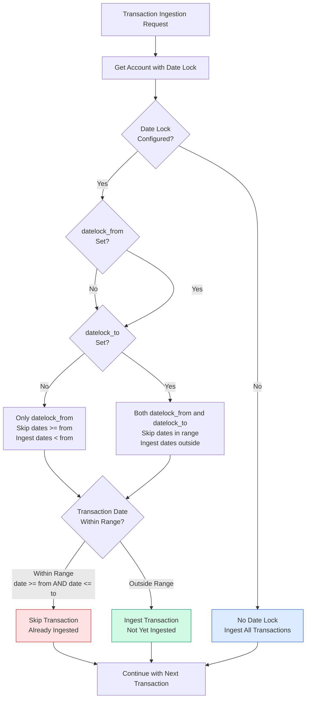
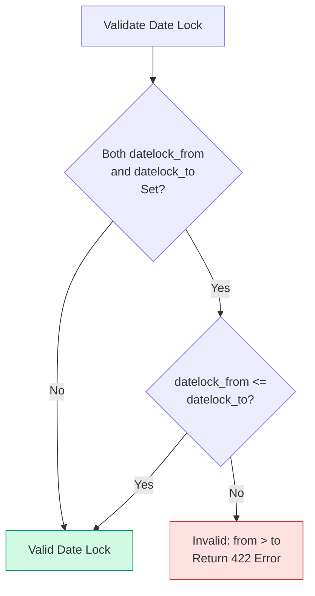

# Date Lock Logic

## Overview

Date lock is a mechanism to mark date ranges that have **already been ingested** for an account. This prevents re-ingestion of the same data and allows selective ingestion of new date ranges.

## Core Concept

**Date lock marks what's already done, not what to block.**

- Transactions **within** the locked range → **skipped** (already ingested)
- Transactions **outside** the locked range → **ingested** (not yet ingested)

## Date Lock Range

An account can have two date lock fields:

- `datelock_from` - Marks dates >= this date as already ingested
- `datelock_to` - Marks dates <= this date as already ingested

Together, they form an inclusive range `[datelock_from, datelock_to]` that represents dates that have already been processed.

## Logic Flow



## Examples

### Example 1: Full Range Lock

**Scenario:** You've ingested Feb 1-28, 2025

```
datelock_from = 2025-02-01
datelock_to = 2025-02-28
```

**Result:**
- ✅ Ingest: Jan 2024, Jan 2025, March 2025, etc. (outside range)
- ❌ Skip: Feb 1-28, 2025 (within range)

### Example 2: One-Sided Lock (From Only)

**Scenario:** You've ingested everything from Jan 1, 2024 onwards

```
datelock_from = 2024-01-01
datelock_to = null
```

**Result:**
- ✅ Ingest: Dates before 2024-01-01
- ❌ Skip: Dates >= 2024-01-01

### Example 3: One-Sided Lock (To Only)

**Scenario:** You've ingested everything up to Dec 31, 2023

```
datelock_from = null
datelock_to = 2023-12-31
```

**Result:**
- ✅ Ingest: Dates after 2023-12-31
- ❌ Skip: Dates <= 2023-12-31

### Example 4: No Lock

**Scenario:** No dates have been ingested yet

```
datelock_from = null
datelock_to = null
```

**Result:**
- ✅ Ingest: All transactions (no restrictions)

## Validation Rules



**Validation:**
- If both `datelock_from` and `datelock_to` are set: `datelock_from <= datelock_to` must be true
- If only one is set: No validation needed (one-sided lock)
- If both are null: No validation needed (no lock)

## Implementation

### Backend Validation

**Location:** `backend/server/api/schemas/account.py`

```python
@model_validator(mode="after")
def validate_date_lock_range(self):
    """Validate that datelock_from <= datelock_to if both are set."""
    if self.datelock_from is not None and self.datelock_to is not None:
        if self.datelock_from > self.datelock_to:
            raise ValueError(
                f"datelock_from ({self.datelock_from}) must be <= datelock_to ({self.datelock_to})"
            )
    return self
```

### Ingestion Logic (Future)

**Location:** `backend/server/services/transaction.py` (to be implemented)

```python
def _should_skip_transaction(
    self, transaction_date: date, account: Account
) -> bool:
    """Check if transaction should be skipped based on date lock.

    Returns True if transaction is within locked range (already ingested).
    """
    # No lock - ingest everything
    if account.datelock_from is None and account.datelock_to is None:
        return False

    # Check if within locked range
    within_from = (
        account.datelock_from is None
        or transaction_date >= account.datelock_from
    )
    within_to = (
        account.datelock_to is None
        or transaction_date <= account.datelock_to
    )

    # If both conditions met, transaction is within locked range
    return within_from and within_to
```

## Edge Cases

### Exact Date Match

If `datelock_from = datelock_to = 2025-02-15`:
- Only transactions on 2025-02-15 are skipped
- All other dates are ingested

### Changing Date Lock

**Important:** Changing date lock does NOT delete existing transactions.

- Only affects **future ingestion runs**
- Previously ingested transactions remain in database
- Allows re-ingestion if date lock is expanded

## Related Components

- **Model:** `backend/server/models/account.py` - Account model with date lock fields
- **Schema:** `backend/server/api/schemas/account.py` - Validation logic
- **Service:** `backend/server/services/account.py` - Account CRUD operations
- **Frontend:** `frontend/src/components/accounts/DateLockField.vue` - UI component
