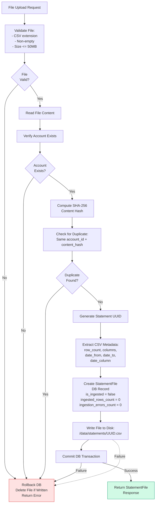
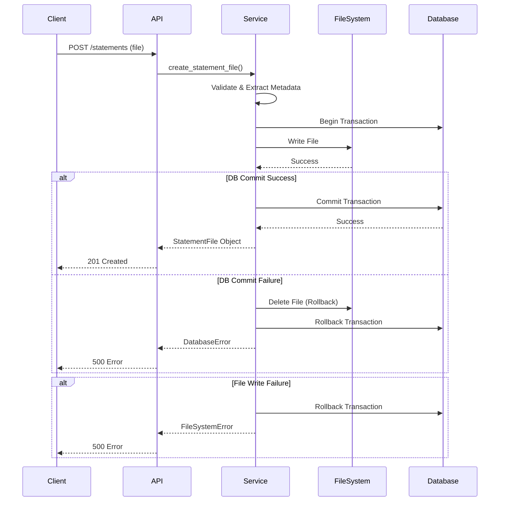
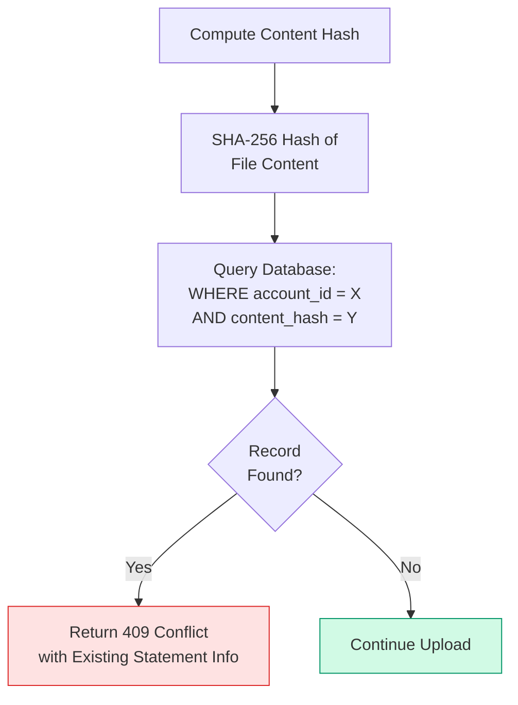
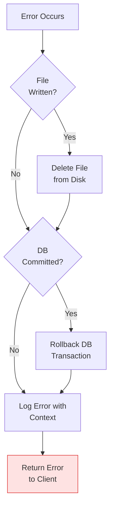

# Statement File Upload Logic

## Overview

Statement file upload is an **atomic operation** that ensures file storage and database record creation succeed or fail together. The process includes duplicate detection, metadata extraction, and error handling.

## Upload Flow

## Atomic Operation Guarantee

The upload process ensures **atomicity** - either both file and database record are created, or neither:

## Duplicate Detection

**Duplicate Detection Rules:**
- Same file content (hash) uploaded to **same account** → Duplicate
- Same file content uploaded to **different account** → Allowed (different account_id)
- Different file content → Always allowed

## Error Recovery

**Error Handling Strategy:**
1. If file written but DB fails → Delete file (cleanup)
2. If DB committed but file write fails → Rollback DB (shouldn't happen, but safe)
3. Log all errors with context for debugging
4. Return appropriate HTTP status codes

## File Storage

**Location:** `/data/statements/{uuid}.csv`

**Naming:** Uses UUID from database record to ensure uniqueness

**Persistence:** Files stored in persistent volume (Docker volume mount)

## Initial State

When a statement file is created, it starts with:

- `is_ingested = false`
- `ingested_rows_count = 0`
- `ingestion_errors_count = 0`
- `ingested_at = null`
- `date_column = <detected column name or null>`

These fields are updated during the ingestion process.

## Related Components

- **Service:** `backend/server/services/statement_file.py` - `create_statement_file` method
- **Router:** `backend/server/api/routers/v1/statements.py` - Upload endpoint
- **Model:** `backend/server/models/statement_file.py` - StatementFile model
- **Schema:** `backend/server/api/schemas/statement_file.py` - Response schemas
